# 3D-printed-speaker
This project is not a program, so there is no source file. But it may be future work to include programmable LEDs to realize a very cool effect. This project intends to design and assemble a small speaker. 

## Demo

<a href="https://www.youtube.com/watch?v=8Td4ZU2-uck">
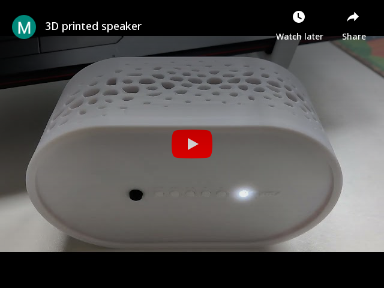
</a>

## Software
Rhinoceros 3D.

## Design

 
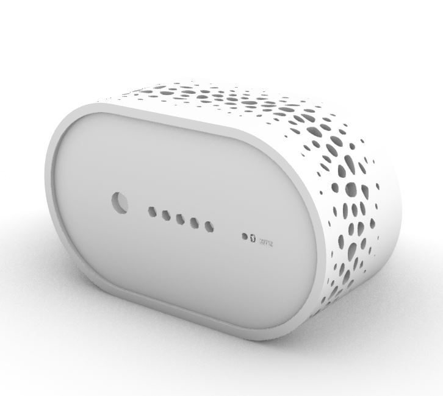

 
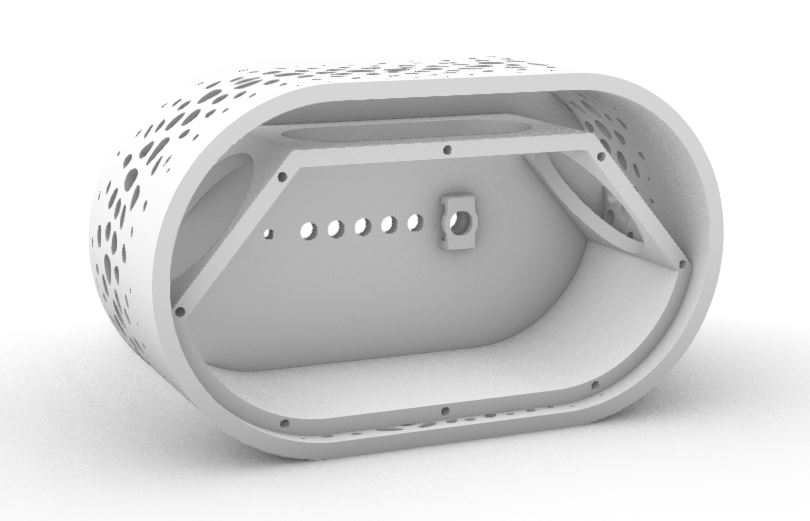

 
    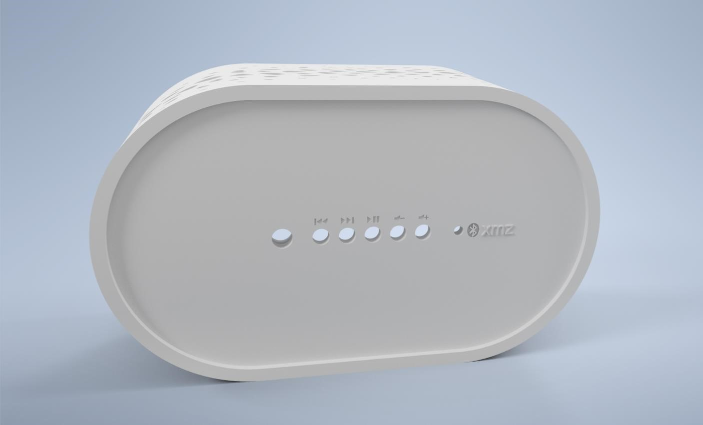
    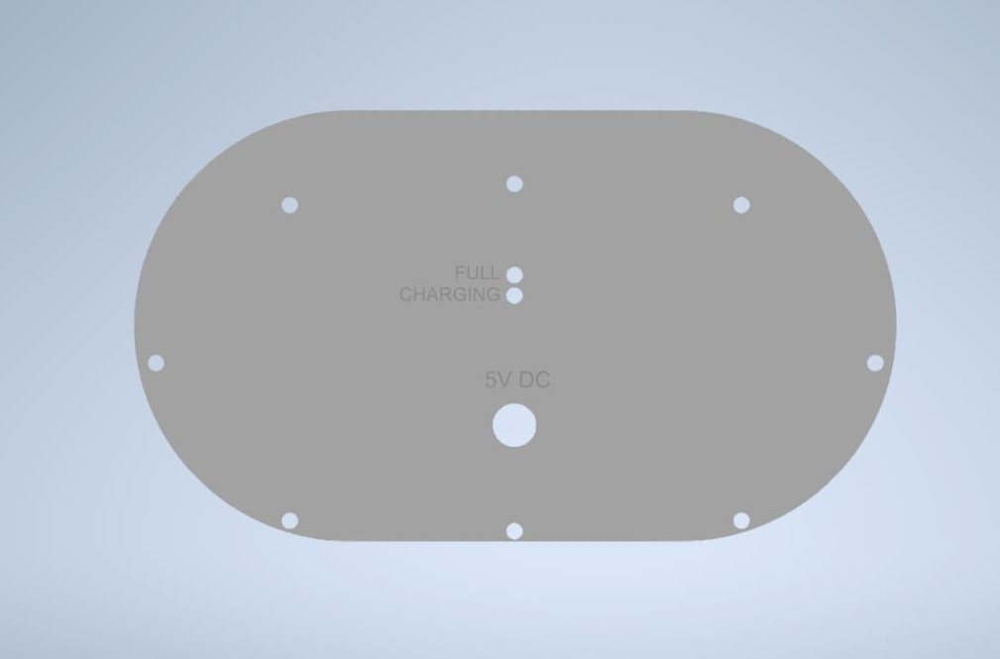

## 3D Print

 
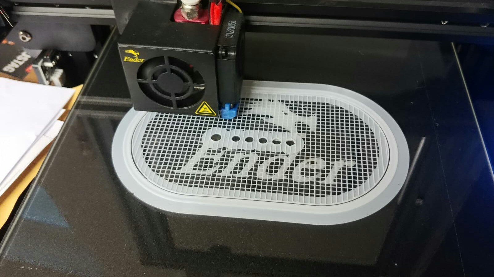
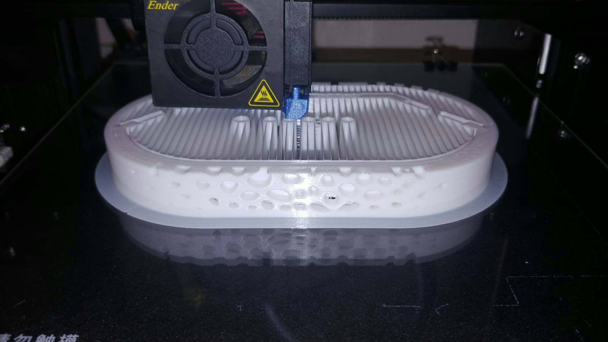
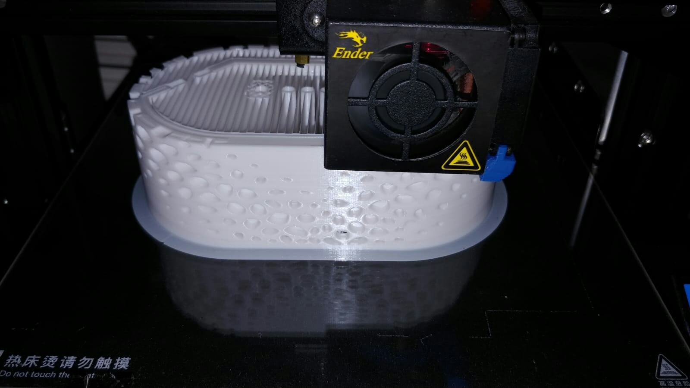
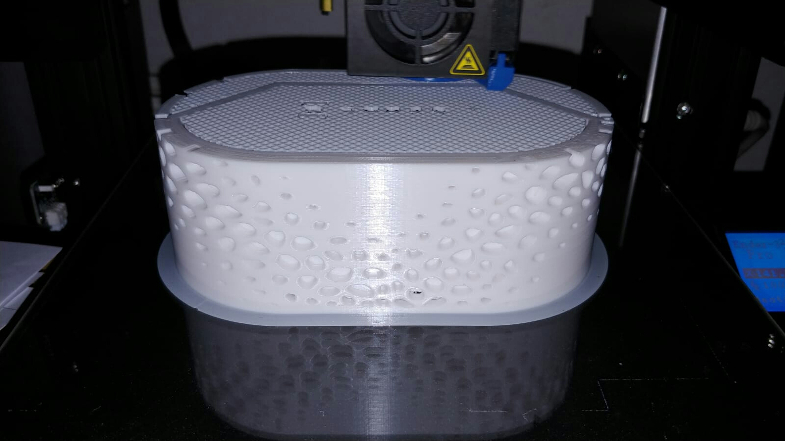

### Surface

 
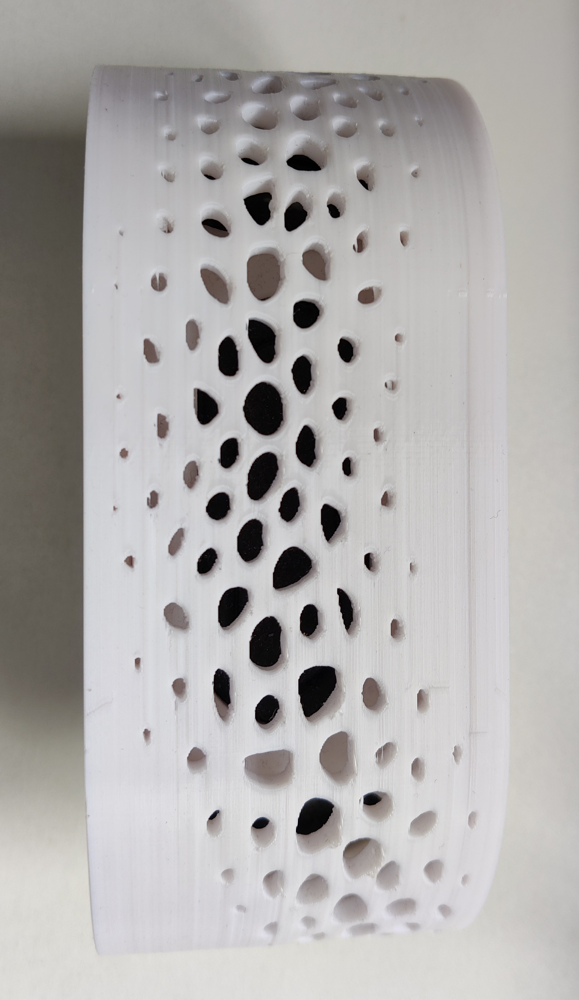
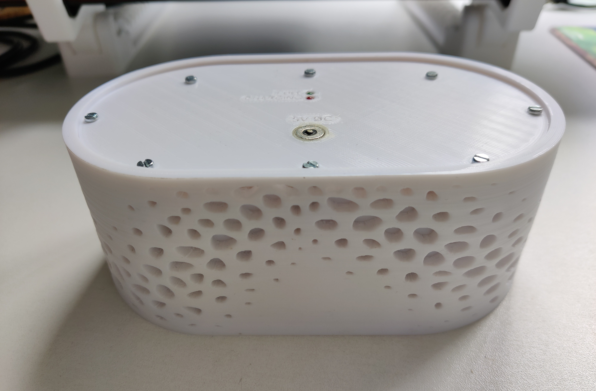

## Hardware

